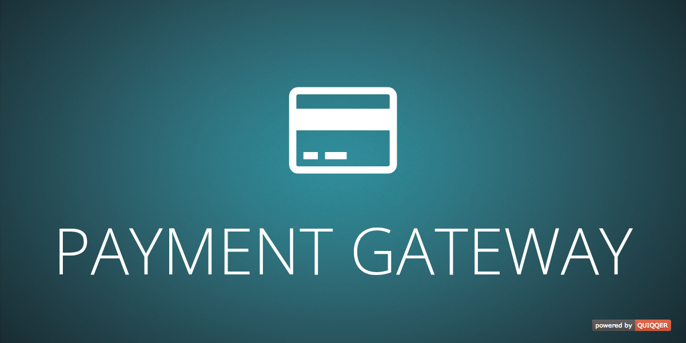

> ⚠️ **EXAMPLE MODULE — NOT FOR PRODUCTION**
>
> ============================================================
>
> This repository demonstrates how a payment gateway can be implemented for QUIQQER.
> It does not connect to a real payment service provider and must not be used to process live payments.
>
> ============================================================



# QUIQQER Payment Gateway Example

This package is a reference implementation for developers building a gateway-based payment method for QUIQQER. It shows how a payment provider, payment type, checkout control, redirect flow, simulated provider endpoint, transaction purchase, and refund hook fit together.

## Requirements

- PHP 8.2 or newer
- QUIQQER Core 2
- QUIQQER Order 2.11.2 or newer
- QUIQQER Payments 4

## Installation

Install the example package in a QUIQQER system:

```bash
composer require quiqqer/payments-gateway
```

Run the QUIQQER setup after installation so that the payment provider and event declarations are imported.

## What the example contains

- `Provider/Payments.php` registers the example payment type.
- `Payment.php` implements the gateway, purchase, success, and refund APIs.
- `PaymentDisplay.php` and `PaymentDisplay.html` render the checkout hand-off form.
- `Server/Server.php` simulates an external provider and builds trusted redirect responses.
- `Server/Server.Result.html` renders the simulated provider confirmation page.
- `events.xml` connects the simulated provider endpoint to the QUIQQER request lifecycle.

## Example flow

1. The checkout renders the example gateway form for an order.
2. The simulated provider loads the order and calculates the amount on the server.
3. The customer chooses to pay or cancel.
4. A trusted redirect returns to the QUIQQER gateway endpoint.
5. The payment method creates the example payment transaction.

The simulated server deliberately avoids trusting posted redirect URLs or payment amounts. A real provider integration must additionally implement the provider's authenticated API, signature or webhook verification, idempotency rules, error handling, and operational monitoring.

## Development

Initialize the package-local development tools:

```bash
composer dev:init
```

Run all standard checks:

```bash
composer test
```

The test suite includes behavior coverage for payment metadata, gateway redirects, server-side amount calculation, invalid requests, and refund failure handling.

## Support

- Issues: <https://dev.quiqqer.com/quiqqer/payments-gateway/-/issues>
- Source: <https://dev.quiqqer.com/quiqqer/payments-gateway>
- Email: <info@quiqqer.com>

## License

MIT. See [LICENSE](LICENSE).
